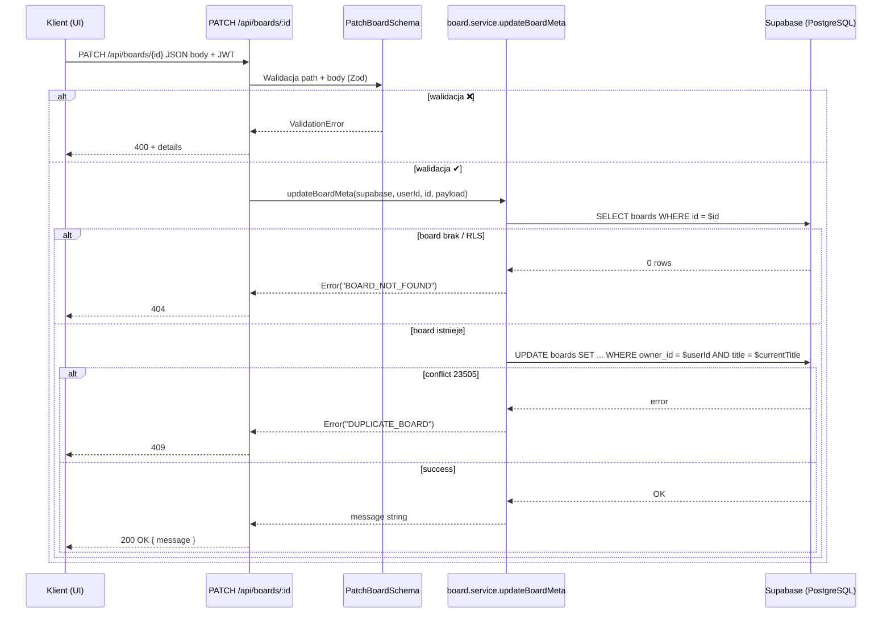

# API Endpoint Implementation Plan: PATCH /api/boards/:id

## 1. Przegląd punktu końcowego

Celem punktu końcowego jest umożliwienie właścicielowi tablicy częściowej aktualizacji metadanych tablicy (tytuł, widoczność publiczna, tagi). Endpoint nie zmienia kart ani poziomów — dotyczy wyłącznie pól tabeli `boards`.

**Kluczowa cecha**: Endpoint aktualizuje **wszystkie poziomy** tablicy o tym samym tytule, nie tylko pojedynczy board wskazany przez `:id`. Dzięki temu metadane pozostają spójne dla całej tablicy wielopoziomowej.

- **URL**: `/api/boards/:id`
- **Metoda**: `PATCH`
- **Uprawnienia**: Autentykowany użytkownik będący właścicielem tablicy
- **Prerender**: `export const prerender = false` (endpoint serwerowy)
- **Archiwizacja**: Nie można edytować zarchiwizowanej tablicy. Archiwizacja odbywa się przez `DELETE /api/boards/:id`

---

## 2. Szczegóły żądania

### 2.1 Parametry

| Źródło | Nazwa | Typ    | Wymagany | Opis                            |
| ------ | ----- | ------ | -------- | ------------------------------- |
| Path   | `id`  | `uuid` | ✔       | Id tablicy zgodny z `boards.id` |

### 2.2 Body (JSON)

Używa schematu `PatchBoardSchema` (z `src/lib/validation/boards.ts`):

```ts
{
  title?: string;        // 1–255 znaków
  isPublic?: boolean;
  tags?: string[];       // ≤ 10 tagów, każdy ≤ 20 znaków
}
```

_Wymagane_: co najmniej jedno pole.

**Uwaga**: Pole `archived` **nie** jest obsługiwane przez ten endpoint. Archiwizacja odbywa się przez osobny endpoint `DELETE /api/boards/:id`.

---

## 3. Wykorzystywane typy

### Validation (Zod schemas)

- **PatchBoardSchema** (`src/lib/validation/boards.ts`) – walidacja ciała żądania
- **BoardIdParamSchema** – walidacja parametru `:id` w URL

### Types (TypeScript)

- **PatchBoardCmd** (`src/types.ts`) – typ komend (zawiera również nieużywane pola `archived?` i `pairs?`)
- **PatchBoardInput** – typ inferred z `PatchBoardSchema`, używany w rzeczywistej implementacji

### Response

- Endpoint zwraca: `{ message: string }` zamiast `BoardDetailDTO`

---

## 4. Szczegóły odpowiedzi

| Kod                           | Body                  | Warunek                                                             |
| ----------------------------- | --------------------- | ------------------------------------------------------------------- |
| **200 OK**                    | `{ message: string }` | Aktualizacja zakończona powodzeniem                                 |
| **400 Bad Request**           | `{ error, details? }` | Błąd walidacji, brak zmian lub próba edycji zarchiwizowanej tablicy |
| **401 Unauthorized**          | `{ error }`           | Brak JWT lub nie jesteś właścicielem                                |
| **404 Not Found**             | `{ error }`           | Tablica nie istnieje lub brak dostępu                               |
| **409 Conflict**              | `{ error }`           | Duplikat tytułu (UNIQUE na (owner_id, title, level))                |
| **500 Internal Server Error** | `{ error }`           | Inne błędy serwera                                                  |

**Przykład odpowiedzi 200 OK**:

```json
{
  "message": "updated title, is_public, tags for all levels"
}
```

---

## 5. Przepływ danych



---

## 6. Logika biznesowa - Aktualizacja wszystkich poziomów

**Kluczowa cecha**: Endpoint aktualizuje **wszystkie poziomy** tablicy o tym samym tytule, a nie tylko pojedynczy board wskazany przez `:id`.

### Implementacja w `updateBoardMeta`:

1. Pobiera board o podanym `boardId` w celu weryfikacji:
   - Czy istnieje
   - Czy użytkownik jest właścicielem
   - Czy nie jest zarchiwizowana
2. Następnie wykonuje UPDATE na **wszystkich** boardach spełniających warunki:
   ```sql
   UPDATE boards
   SET ...
   WHERE owner_id = $userId AND title = $currentTitle
   ```
3. To oznacza, że jeśli masz tablicę "JavaScript Basics" z 3 poziomami, aktualizacja któregokolwiek z nich zmieni metadane (tytuł, widoczność, tagi) dla wszystkich trzech poziomów.

### Uzasadnienie:

W modelu danych tablice wielopoziomowe są reprezentowane jako osobne rekordy w tabeli `boards` o tym samym tytule i różnych wartościach `level`. Metadane takie jak tytuł, widoczność publiczna czy tagi powinny być spójne dla wszystkich poziomów tej samej tablicy.

---

## 7. Względy bezpieczeństwa

1. **Autoryzacja**: middleware JWT w `src/middleware/index.ts` ustawia `locals.user` i `locals.supabase` z tokenem użytkownika. Service layer jawnie sprawdza `owner_id` przed wykonaniem UPDATE.
2. **Walidacja danych**: Zod + guard clauses (wcześnie odrzucamy nieprawidłowe dane).
3. **Ochrona przed masową aktualizacją**: Schema wyraźnie zawęża pola; ignoruje nieznane właściwości.
4. **SQL Injection**: Kwerendy Supabase są parametryzowane.
5. **Duplikaty**: Obsługa błędu `23505 UNIQUE` ➜ 409 Conflict.
6. **Ochrona zarchiwizowanych**: Sprawdzenie `archived = true` blokuje wszelkie modyfikacje.

---

## 8. Obsługa błędów

| Kod | Mapa `getErrorMapping`                              | Uwagi                                             |
| --- | --------------------------------------------------- | ------------------------------------------------- |
| 400 | `VALIDATION_FAILED`, `BOARD_ARCHIVED`, `NO_CHANGES` | Walidacja, próba zmian na archiwum lub brak zmian |
| 401 | `NOT_OWNER`, `UNAUTHORIZED`                         |
| 404 | `BOARD_NOT_FOUND`                                   |
| 409 | `DUPLICATE_BOARD`, `BOARD_ARCHIVED`                 | Duplikat tytułu lub tablica już zarchiwizowana    |
| 500 | `SERVER_ERROR`                                      | fallback                                          |

---

## 9. Rozważania dotyczące wydajności

- Operacja może dotyczyć wielu wierszy (wszystkie poziomy tablicy), ale zazwyczaj to 1-3 rekordy.
- Indeksy: `PK boards(id)` dla weryfikacji, indeks na `(owner_id, title)` dla UPDATE.
- Operacja jest atomiczna – wszystkie poziomy aktualizowane w jednej transakcji.

---

## 10. Status implementacji

✅ **Zaimplementowano**

Endpoint został w pełni zaimplementowany zgodnie z planem, z następującymi szczegółami:

1. **Validation** ✅
   - `PatchBoardSchema` w `src/lib/validation/boards.ts` (linie 154-176)
   - Zawiera pola: `title`, `isPublic`, `tags` (wszystkie opcjonalne)
   - Walidacja wymaga co najmniej jednego pola

2. **Service layer** ✅
   - Funkcja `updateBoardMeta` w `src/lib/services/board.service.ts` (linie 489-557)
   - Weryfikuje własność, sprawdza czy board nie jest zarchiwizowany
   - Aktualizuje wszystkie poziomy tablicy o tym samym tytule
   - Zwraca komunikat opisujący zaktualizowane pola

3. **Error mapping** ✅
   - `DUPLICATE_BOARD`, `BOARD_ARCHIVED`, `NO_CHANGES`, `NOT_OWNER`, `BOARD_NOT_FOUND` w `src/lib/utils/api-response.ts`

4. **Route handler** ✅
   - Handler `PATCH` w `src/pages/api/boards/[id].ts` (linie 72-119)
   - Pełna walidacja parametrów i body
   - Weryfikacja autentykacji
   - Obsługa błędów przez `ValidationError`, `HttpError` i `getErrorMapping`

### Różnice względem początkowego planu:

- **Odpowiedź**: Zwraca `{ message: string }` zamiast `BoardDetailDTO`
- **Pole `archived`**: Nie jest obsługiwane (archiwizacja przez `DELETE /api/boards/:id`)
- **Zakres aktualizacji**: Modyfikuje wszystkie poziomy tablicy zamiast pojedynczego board
