# Diagram Sekwencji Autentykacji - Definition Quest

## Analiza przepływów autentykacji

<authentication_analysis>

### 1. Przepływy autentykacji wymienione w specyfikacji

**Przepływy główne:**

- Rejestracja użytkownika (signUp)
- Logowanie użytkownika (login)
- Wylogowanie użytkownika (logout)
- Żądanie resetu hasła (forgot-password)
- Resetowanie hasła (reset-password)
- Weryfikacja emaila po rejestracji
- Odświeżanie tokenu sesji

**Przepływy zabezpieczeń:**

- Sprawdzanie sesji przez middleware dla endpointów API
- Sprawdzanie sesji przez AuthenticatedLayout dla stron
- Automatyczne przekierowania dla niezalogowanych użytkowników

### 2. Główni aktorzy i ich interakcje

**Aktorzy:**

- **Przeglądarka** - frontend użytkownika (React komponenty w Astro)
- **Middleware** - warstwa pośrednia Astro sprawdzająca autentykację
- **Astro API** - endpointy autentykacji w `src/pages/api/auth/`
- **Supabase Auth** - backend autentykacyjny zarządzający sesjami

**Interakcje:**

- Przeglądarka wysyła requesty do Astro API
- Middleware przechwytuje requesty i weryfikuje sesję
- Astro API komunikuje się z Supabase Auth
- Supabase Auth zarządza sesjami przez HTTP-only cookies
- Middleware dodaje user do context.locals dla chronionych endpointów

### 3. Procesy weryfikacji i odświeżania tokenów

**Weryfikacja tokenów:**

- Access token (JWT) z czasem życia 1 godzina
- Refresh token z czasem życia 30 dni
- Tokeny przechowywane w HTTP-only cookies (bezpieczne przed XSS)
- Middleware wywołuje `supabase.auth.getUser()` dla każdego chronionego requestu

**Odświeżanie tokenów:**

- Supabase client automatycznie odświeża access token przed wygaśnięciem
- Używa refresh token do uzyskania nowego access token
- Proces przezroczysty dla użytkownika i aplikacji
- Brak manualnej implementacji w kodzie aplikacji

**Weryfikacja w różnych kontekstach:**

- W middleware: `await context.locals.supabase.auth.getUser()`
- W stronach Astro: `await Astro.locals.supabase.auth.getSession()`
- W endpointach API: użytkownik dostępny w `locals.user` po przejściu przez middleware

### 4. Opis kroków autentykacji

**Rejestracja:**

1. Użytkownik wypełnia formularz (email, password, displayName)
2. POST do `/api/auth/signUp`
3. Walidacja Zod schema
4. `supabase.auth.signUp()` tworzy konto
5. Utworzenie rekordu w `user_meta` z displayName
6. Supabase wysyła email weryfikacyjny
7. Zwrot sukcesu do przeglądarki

**Logowanie:**

1. Użytkownik wypełnia formularz (email, password)
2. POST do `/api/auth/login`
3. Walidacja Zod schema
4. `supabase.auth.signInWithPassword()` weryfikuje dane
5. Supabase tworzy sesję i ustawia HTTP-only cookie
6. Zwrot sesji do przeglądarki
7. Przekierowanie na dashboard

**Dostęp do chronionego endpointu:**

1. Request do chronionego API endpoint
2. Middleware przechwytuje request
3. Middleware sprawdza czy endpoint w PUBLIC_ENDPOINTS
4. Jeśli nie, middleware wywołuje `getUser()`
5. Jeśli brak użytkownika → 401 Unauthorized
6. Jeśli użytkownik OK → dodanie do locals.user
7. Request przechodzi dalej do endpointu

**Reset hasła:**

1. Użytkownik podaje email w forgot-password
2. POST do `/api/auth/forgot-password`
3. `supabase.auth.resetPasswordForEmail()` wysyła email
4. Użytkownik klika link w emailu
5. Przekierowanie na `/reset-password?token=xxx`
6. Strona weryfikuje token
7. Użytkownik podaje nowe hasło
8. POST do `/api/auth/reset-password`
9. `supabase.auth.updateUser()` aktualizuje hasło

</authentication_analysis>

---

## Diagram Mermaid

```mermaid
sequenceDiagram
    autonumber

    participant Przeglądarka
    participant Middleware
    participant AstroAPI as Astro API
    participant SupabaseAuth as Supabase Auth

    Note over Przeglądarka,SupabaseAuth: Przepływ Rejestracji

    Przeglądarka->>AstroAPI: POST /api/auth/signUp
    Note right of Przeglądarka: email, password, displayName

    AstroAPI->>AstroAPI: Walidacja Zod schema

    AstroAPI->>SupabaseAuth: signUp(email, password)

    alt Rejestracja zakończona sukcesem
        SupabaseAuth-->>AstroAPI: user created
        AstroAPI->>AstroAPI: INSERT user_meta
        Note right of AstroAPI: Zapis displayName
        SupabaseAuth->>Przeglądarka: Email weryfikacyjny
        AstroAPI-->>Przeglądarka: 201 Created
        Note left of Przeglądarka: Komunikat sukcesu
    else Email już istnieje
        SupabaseAuth-->>AstroAPI: Error: User exists
        AstroAPI-->>Przeglądarka: 409 Conflict
    end

    Note over Przeglądarka,SupabaseAuth: Przepływ Logowania

    Przeglądarka->>AstroAPI: POST /api/auth/login
    Note right of Przeglądarka: email, password

    AstroAPI->>AstroAPI: Walidacja Zod schema

    AstroAPI->>SupabaseAuth: signInWithPassword

    alt Dane poprawne
        SupabaseAuth->>SupabaseAuth: Weryfikacja hasła
        SupabaseAuth->>SupabaseAuth: Utworzenie sesji
        SupabaseAuth-->>Przeglądarka: HTTP-only cookie
        Note right of SupabaseAuth: access + refresh token
        SupabaseAuth-->>AstroAPI: user + session
        AstroAPI-->>Przeglądarka: 200 OK + dane użytkownika
        Przeglądarka->>Przeglądarka: Przekierowanie na dashboard
    else Dane niepoprawne
        SupabaseAuth-->>AstroAPI: Error: Invalid credentials
        AstroAPI-->>Przeglądarka: 401 Unauthorized
    end

    Note over Przeglądarka,SupabaseAuth: Dostęp do chronionego endpointu

    Przeglądarka->>Middleware: GET /api/boards
    Note right of Przeglądarka: Cookie z sesją

    Middleware->>Middleware: Sprawdzenie czy PUBLIC_ENDPOINTS

    alt Endpoint chroniony
        Middleware->>SupabaseAuth: getUser()
        Note right of Middleware: Weryfikacja access token

        alt Token prawidłowy
            SupabaseAuth-->>Middleware: user data
            Middleware->>Middleware: Dodanie user do locals
            Middleware->>AstroAPI: Przekazanie requestu
            AstroAPI->>AstroAPI: Przetworzenie requestu
            AstroAPI-->>Przeglądarka: 200 OK + dane
        else Token wygasł
            SupabaseAuth->>SupabaseAuth: Odświeżenie tokenu
            Note right of SupabaseAuth: Użycie refresh token
            SupabaseAuth-->>Przeglądarka: Nowy HTTP-only cookie
            SupabaseAuth-->>Middleware: user data
            Middleware->>AstroAPI: Przekazanie requestu
            AstroAPI-->>Przeglądarka: 200 OK + dane
        else Brak ważnego tokenu
            SupabaseAuth-->>Middleware: Error
            Middleware-->>Przeglądarka: 401 Unauthorized
        end
    else Endpoint publiczny
        Middleware->>AstroAPI: Przekazanie requestu
        AstroAPI-->>Przeglądarka: 200 OK
    end

    Note over Przeglądarka,SupabaseAuth: Przepływ Reset Hasła

    Przeglądarka->>AstroAPI: POST /api/auth/forgot-password
    Note right of Przeglądarka: email

    AstroAPI->>SupabaseAuth: resetPasswordForEmail

    SupabaseAuth->>Przeglądarka: Email z linkiem resetującym
    AstroAPI-->>Przeglądarka: 200 OK
    Note left of Przeglądarka: Zawsze sukces

    Przeglądarka->>Przeglądarka: Użytkownik klika link w emailu

    Przeglądarka->>AstroAPI: GET /reset-password?token=xxx
    Note right of Przeglądarka: Token w URL

    AstroAPI->>SupabaseAuth: verifyOtp(token)

    alt Token prawidłowy
        SupabaseAuth-->>AstroAPI: Sesja tymczasowa
        AstroAPI-->>Przeglądarka: Formularz resetu hasła

        Przeglądarka->>AstroAPI: POST /api/auth/reset-password
        Note right of Przeglądarka: newPassword

        AstroAPI->>SupabaseAuth: updateUser(password)
        SupabaseAuth-->>AstroAPI: Hasło zaktualizowane
        AstroAPI-->>Przeglądarka: 200 OK
        Przeglądarka->>Przeglądarka: Przekierowanie na login
    else Token wygasł
        SupabaseAuth-->>AstroAPI: Error: Invalid token
        AstroAPI-->>Przeglądarka: Przekierowanie na forgot-password
    end

    Note over Przeglądarka,SupabaseAuth: Przepływ Wylogowania

    Przeglądarka->>AstroAPI: POST /api/auth/logout

    AstroAPI->>SupabaseAuth: signOut()

    SupabaseAuth->>SupabaseAuth: Usunięcie sesji
    SupabaseAuth-->>Przeglądarka: Usunięcie HTTP-only cookie
    SupabaseAuth-->>AstroAPI: Potwierdzenie
    AstroAPI-->>Przeglądarka: 200 OK
    Przeglądarka->>Przeglądarka: Przekierowanie na login
```

<mermaid_diagram>

</mermaid_diagram>

---

## Kluczowe informacje

### Zabezpieczenia

- Tokeny przechowywane w HTTP-only cookies (ochrona przed XSS)
- Automatyczne odświeżanie tokenów przez Supabase client
- Middleware weryfikuje każdy request do chronionych endpointów
- Zawsze zwracamy sukces dla forgot-password (ochrona przed wyciekiem informacji)

### Przepływ danych

- Sesja zarządzana przez Supabase Auth automatycznie
- Middleware dodaje user do context.locals dla chronionych endpointów
- Strony Astro sprawdzają sesję w server-side frontmatter
- React komponenty wywołują API endpointy które są chronione przez middleware

### Punkty krytyczne

- Weryfikacja tokenu przy każdym chroniony requescie
- Automatyczne odświeżanie przed wygaśnięciem access token
- Utworzenie user_meta synchronicznie z rejestracją w auth.users
- Obsługa błędów z odpowiednimi kodami HTTP
