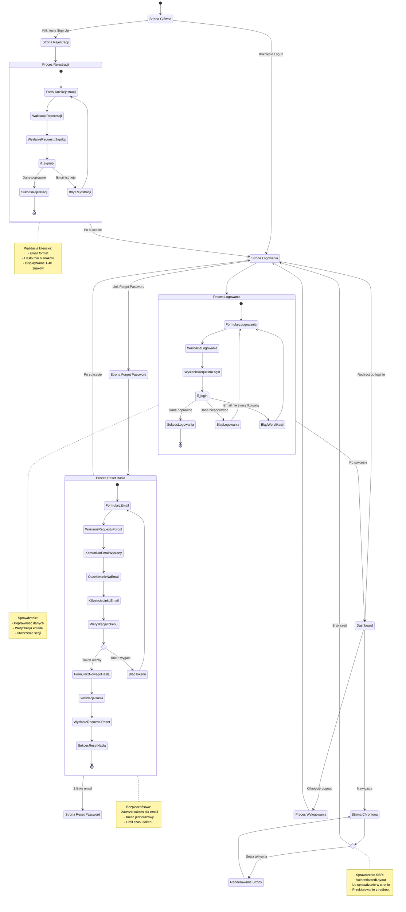

# Diagram Podróży Użytkownika - Definition Quest

## Analiza podróży użytkownika

<user_journey_analysis>

### 1. Wszystkie ścieżki użytkownika wymienione w specyfikacji

**Ścieżki główne autentykacji:**

- Nowy użytkownik zakłada konto (rejestracja)
- Użytkownik loguje się do aplikacji
- Użytkownik wylogowuje się z aplikacji
- Użytkownik zapomniał hasła i resetuje je
- Użytkownik próbuje wejść na chronioną stronę bez logowania

**Ścieżki weryfikacji:**

- Weryfikacja emaila po rejestracji
- Weryfikacja tokenu resetu hasła

**Ścieżki biznesowe z PRD:**

- US-001: Rejestracja i logowanie
- Dostęp do funkcji tylko dla zalogowanych
- Przeglądanie własnych plansz
- Tworzenie nowych plansz
- Rozwiązywanie plansz

### 2. Główne podróże i ich odpowiadające stany

**Podróż rejestracji:**

- StronaGlowna → PrzyciskSignUp → StronaRejestracji
- StronaRejestracji → FormularzRejestracji → WalidacjaDanych
- WalidacjaDanych → WyslanieRequestu → OczekiwanieNaOdpowiedz
- OczekiwanieNaOdpowiedz → [Sukces/Błąd]
- Sukces → KomunikatSukcesu → StronaLogowania
- Błąd → KomunikatBłędu → FormularzRejestracji

**Podróż logowania:**

- StronaLogowania → FormularzLogowania → WalidacjaDanych
- WalidacjaDanych → WyslanieRequestu → OczekiwanieNaOdpowiedz
- OczekiwanieNaOdpowiedz → [Sukces/Błąd]
- Sukces → UstawienieSessionCookie → Dashboard
- Błąd → KomunikatBłędu → FormularzLogowania

**Podróż resetu hasła:**

- StronaLogowania → LinkForgotPassword → StronaForgotPassword
- StronaForgotPassword → FormularzEmail → WyslanieRequestu
- WyslanieRequestu → KomunikatSukcesu
- Email → KlikniecieLinkuReset → StronaResetPassword
- StronaResetPassword → WeryfikacjaTokenu → [TokenOK/TokenBłędny]
- TokenOK → FormularzNowegoHasła → WyslanieRequestu
- WyslanieRequestu → AktualizacjaHasła → StronaLogowania

**Podróż dostępu do chronionej strony:**

- WpisanieURLChronionej → SprawdzenieSessionSSR
- SprawdzenieSessionSSR → [SesjaOK/BrakSesji]
- BrakSesji → PrzekierowanieNaLogin → FormularzLogowania
- SesjaOK → RenderowanieStrony

### 3. Punkty decyzyjne i alternatywne ścieżki

**Decyzja: Czy użytkownik jest zalogowany?**

- TAK → Dostęp do chronionej funkcjonalności
- NIE → Przekierowanie na login

**Decyzja: Czy dane rejestracji są poprawne?**

- TAK → Utworzenie konta, wysłanie emaila weryfikacyjnego
- NIE → Komunikat błędu (email już istnieje, hasło za krótkie)

**Decyzja: Czy dane logowania są poprawne?**

- TAK → Utworzenie sesji, przekierowanie na dashboard
- NIE → Komunikat błędu (nieprawidłowe dane, email nie zweryfikowany)

**Decyzja: Czy token resetu hasła jest ważny?**

- TAK → Formularz nowego hasła
- NIE → Przekierowanie na forgot-password z komunikatem

**Decyzja: Czy sesja jest aktywna przy dostępie do chronionej strony?**

- TAK → Renderowanie strony
- NIE → Przekierowanie na login z redirect param

### 4. Opis celu każdego stanu

**StronaGlowna:**

- Cel: Punkt wejścia dla nowych użytkowników
- Akcje: Wyświetlenie opcji Sign up / Log in

**FormularzRejestracji:**

- Cel: Zebranie danych do utworzenia konta
- Akcje: Walidacja email, password, displayName

**OczekiwanieNaOdpowiedz:**

- Cel: Informowanie użytkownika o trwającej operacji
- Akcje: Loading state, blokada formularza

**KomunikatSukcesu:**

- Cel: Potwierdzenie wykonania akcji
- Akcje: Wyświetlenie komunikatu, opcjonalne auto-przekierowanie

**FormularzLogowania:**

- Cel: Uwierzytelnienie użytkownika
- Akcje: Walidacja email, password

**Dashboard:**

- Cel: Główna strona aplikacji dla zalogowanych
- Akcje: Wyświetlenie plansz, statystyk, opcji

**StronaForgotPassword:**

- Cel: Rozpoczęcie procesu resetu hasła
- Akcje: Zebranie emaila, wysłanie linku resetującego

**StronaResetPassword:**

- Cel: Ustawienie nowego hasła
- Akcje: Weryfikacja tokenu, walidacja nowego hasła

**SprawdzenieSessionSSR:**

- Cel: Zabezpieczenie dostępu do chronionej strony
- Akcje: Weryfikacja sesji po stronie serwera

**PrzekierowanieNaLogin:**

- Cel: Skierowanie niezalogowanego użytkownika do logowania
- Akcje: Przekierowanie z zapisaniem URL docelowego

</user_journey_analysis>

---

## Diagram Mermaid

<mermaid_diagram>

</mermaid_diagram>

---

## Kluczowe informacje

### Punkty kluczowe w podróży użytkownika

**Moment rejestracji:**

- Użytkownik podaje email, hasło, displayName
- Walidacja po stronie klienta i serwera
- Wysłanie emaila weryfikacyjnego
- Komunikat sukcesu z instrukcją sprawdzenia emaila

**Moment logowania:**

- Użytkownik podaje email, hasło
- Sprawdzenie poprawności danych
- Utworzenie sesji i HTTP-only cookie
- Przekierowanie na dashboard lub URL z redirect param

**Moment resetu hasła:**

- Użytkownik podaje email
- Zawsze komunikat sukcesu (bezpieczeństwo)
- Link w emailu z tokenem jednorazowym
- Weryfikacja tokenu przed pokazaniem formularza
- Ustawienie nowego hasła

**Moment dostępu do chronionej strony:**

- Sprawdzenie sesji po stronie serwera (SSR)
- Jeśli brak sesji → przekierowanie na login z zapisanym URL
- Po zalogowaniu → powrót na oryginalny URL
- Jeśli sesja OK → renderowanie strony

### Doświadczenie użytkownika (UX)

**Loading states:**

- Wyświetlanie spinnera podczas operacji API
- Blokada formularza podczas wysyłania
- Komunikat "Sending..." lub "Loading..."

**Komunikaty błędów:**

- Inline pod polem (walidacja kliencka)
- Alert nad formularzem (błędy serwera)
- Przyjazne komunikaty (nie techniczne)

**Komunikaty sukcesów:**

- Alert z zielonym tłem
- Automatyczne przekierowanie (opcjonalnie)
- Link do następnej akcji

**Dostępność:**

- Focus management (automatyczne focus na pierwszym polu)
- Aria-labels na wszystkich interaktywnych elementach
- Kontrast minimum 4.5:1
- Obsługa klawiatury (Tab, Enter)

### Zabezpieczenia w podróży użytkownika

**Ochrona przed wyciekiem informacji:**

- Forgot-password zawsze zwraca sukces
- Nie ujawniamy czy email istnieje w bazie
- Nie ujawniamy szczegółów błędów autentykacji

**Ochrona przed nieautoryzowanym dostępem:**

- Wszystkie chronione strony wymagają sesji
- Sprawdzenie po stronie serwera (SSR)
- Przekierowanie z zapisaniem docelowego URL
- Tokeny resetu hasła jednorazowe i czasowe

**Ochrona przed atakami:**

- HTTP-only cookies (XSS protection)
- CSRF protection przez origin checking
- Rate limiting (produkcja)
- Walidacja Zod po stronie serwera
