# Diagram Architektury UI - Definition Quest

## Analiza architektury komponentów

<architecture_analysis>

### 1. Wszystkie komponenty wymienione w specyfikacji

**Strony Astro (nowe):**
- `login.astro` - strona logowania
- `signup.astro` - strona rejestracji
- `forgot-password.astro` - strona żądania resetu hasła
- `reset-password.astro` - strona resetowania hasła
- `email-confirmed.astro` - potwierdzenie weryfikacji emaila
- `dashboard.astro` - główna strona aplikacji (lub rozszerzenie index.astro)

**Strony Astro (istniejące):**
- `index.astro` - strona powitalna

**Layouty:**
- `Layout.astro` - podstawowy layout (istniejący, wymaga rozszerzenia)
- `AuthenticatedLayout.astro` - layout dla stron wymagających autentykacji (nowy)

**Komponenty React Auth:**
- `LoginForm.tsx` - formularz logowania
- `SignUpForm.tsx` - formularz rejestracji
- `ForgotPasswordForm.tsx` - formularz żądania resetu hasła
- `ResetPasswordForm.tsx` - formularz resetowania hasła
- `UserNav.tsx` - nawigacja użytkownika z dropdown menu

**Komponenty UI (Shadcn/ui - do stworzenia):**
- `Input.tsx` - pole tekstowe
- `Label.tsx` - etykieta dla pól
- `Alert.tsx` - komunikaty błędów i sukcesów
- `DropdownMenu.tsx` - menu dropdown dla UserNav
- `Avatar.tsx` - awatar użytkownika
- `Button.tsx` - przycisk (istniejący)

**Komponenty istniejące:**
- `Welcome.astro` - komponent powitalny

### 2. Główne strony i ich odpowiadające komponenty

**Strona logowania (`login.astro`):**
- Używa: Layout.astro
- Zawiera: LoginForm (React, client:load)
- Funkcja: renderowanie formularza logowania, sprawdzenie sesji SSR

**Strona rejestracji (`signup.astro`):**
- Używa: Layout.astro
- Zawiera: SignUpForm (React, client:load)
- Funkcja: renderowanie formularza rejestracji, sprawdzenie sesji SSR

**Strona forgot-password (`forgot-password.astro`):**
- Używa: Layout.astro
- Zawiera: ForgotPasswordForm (React, client:load)
- Funkcja: żądanie resetu hasła

**Strona reset-password (`reset-password.astro`):**
- Używa: Layout.astro
- Zawiera: ResetPasswordForm (React, client:load)
- Funkcja: ustawienie nowego hasła, weryfikacja tokenu SSR

**Strona dashboard (`dashboard.astro`):**
- Używa: AuthenticatedLayout.astro
- Zawiera: komponenty listy plansz, statystyki
- Funkcja: główna strona aplikacji, wymaga autentykacji

**Layout podstawowy (`Layout.astro`):**
- Używa: warunkowy UserNav jeśli użytkownik zalogowany
- Funkcja: struktura HTML, sprawdzenie sesji SSR, warunkowe renderowanie nawigacji

**Layout chroniony (`AuthenticatedLayout.astro`):**
- Używa: UserNav (zawsze)
- Funkcja: sprawdzenie sesji SSR, przekierowanie jeśli brak sesji, renderowanie UserNav

### 3. Przepływ danych między komponentami

**Rejestracja:**
```
SignUpForm → POST /api/auth/signUp → Supabase Auth
                ↓
         user_meta INSERT
                ↓
         Komunikat sukcesu
                ↓
    Przekierowanie na login.astro
```

**Logowanie:**
```
LoginForm → POST /api/auth/login → Supabase Auth
                ↓
         Cookie z sesją
                ↓
    Przekierowanie na dashboard.astro
                ↓
         AuthenticatedLayout
                ↓
            UserNav
```

**Dostęp do chronionej strony:**
```
Request → AuthenticatedLayout.astro
              ↓
    Sprawdzenie sesji (SSR)
              ↓
         Sesja OK?
         /      \
       Tak      Nie
        ↓        ↓
    Render   Redirect login
        ↓
    UserNav + Content
```

**UserNav interakcja:**
```
UserNav (client:load)
    ↓
Pobiera user z props
    ↓
Wyświetla dropdown
    ↓
Kliknięcie Logout
    ↓
POST /api/auth/logout
    ↓
Przekierowanie na login
```

### 4. Opis funkcjonalności każdego komponentu

**LoginForm:**
- Zarządzanie stanem (email, password, isLoading, error)
- Walidacja kliencka (email format, password min 6 znaków)
- Wywołanie POST /api/auth/login
- Obsługa błędów i loading state
- Linki do forgot-password i signup
- Przekierowanie po sukcesie

**SignUpForm:**
- Zarządzanie stanem (email, password, displayName, isLoading, error, success)
- Walidacja kliencka (email, password, displayName 1-40 znaków)
- Wywołanie POST /api/auth/signUp
- Obsługa błędów (np. email już istnieje)
- Komunikat sukcesu lub przekierowanie

**ForgotPasswordForm:**
- Zarządzanie stanem (email, isLoading, success, error)
- Wywołanie POST /api/auth/forgot-password
- Komunikat sukcesu (zawsze pokazujemy sukces dla bezpieczeństwa)

**ResetPasswordForm:**
- Zarządzanie stanem (newPassword, confirmPassword, isLoading, error)
- Walidacja: hasło min 6 znaków, oba pola identyczne
- Wywołanie POST /api/auth/reset-password
- Przekierowanie na login po sukcesie

**UserNav:**
- Wyświetlenie info o użytkowniku (displayName, avatar)
- Dropdown menu (Profile, Settings, Log out)
- Wywołanie POST /api/auth/logout przy wylogowaniu
- Przekierowanie na login po wylogowaniu

**Layout.astro:**
- Sprawdzenie sesji SSR
- Pobranie user_meta jeśli user zalogowany
- Warunkowe renderowanie UserNav
- Podstawowa struktura HTML

**AuthenticatedLayout.astro:**
- Sprawdzenie sesji SSR
- Przekierowanie na login jeśli brak sesji
- Pobranie user_meta
- Renderowanie UserNav
- Slot dla treści strony

</architecture_analysis>

---

## Diagram Mermaid

```mermaid
flowchart TD
    subgraph Publiczne["Strony Publiczne"]
        LoginPage["login.astro"]
        SignupPage["signup.astro"]
        ForgotPage["forgot-password.astro"]
        ResetPage["reset-password.astro"]
        EmailConfirmed["email-confirmed.astro"]
        IndexPage["index.astro"]
    end
    
    subgraph Chronione["Strony Chronione"]
        Dashboard["dashboard.astro"]
        BoardsPages["Inne strony boards/*"]
    end
    
    subgraph Layouts["Layouty"]
        BaseLayout["Layout.astro"]
        AuthLayout["AuthenticatedLayout.astro"]
    end
    
    subgraph ReactForms["Formularze React"]
        LoginForm["LoginForm.tsx"]
        SignUpForm["SignUpForm.tsx"]
        ForgotForm["ForgotPasswordForm.tsx"]
        ResetForm["ResetPasswordForm.tsx"]
    end
    
    subgraph ReactNav["Nawigacja React"]
        UserNav["UserNav.tsx"]
    end
    
    subgraph UIComponents["Komponenty UI Shadcn/ui"]
        Button["Button.tsx"]
        Input["Input.tsx"]
        Label["Label.tsx"]
        Alert["Alert.tsx"]
        Dropdown["DropdownMenu.tsx"]
        Avatar["Avatar.tsx"]
    end
    
    subgraph API["Endpointy API"]
        LoginAPI["POST /api/auth/login"]
        SignUpAPI["POST /api/auth/signUp"]
        LogoutAPI["POST /api/auth/logout"]
        ForgotAPI["POST /api/auth/forgot-password"]
        ResetAPI["POST /api/auth/reset-password"]
    end
    
    subgraph Auth["Warstwa Autentykacji"]
        Middleware["Middleware Astro"]
        Supabase["Supabase Auth"]
    end
    
    LoginPage -->|używa| BaseLayout
    SignupPage -->|używa| BaseLayout
    ForgotPage -->|używa| BaseLayout
    ResetPage -->|używa| BaseLayout
    EmailConfirmed -->|używa| BaseLayout
    IndexPage -->|używa| BaseLayout
    
    Dashboard -->|używa| AuthLayout
    BoardsPages -->|używa| AuthLayout
    
    LoginPage -->|renderuje client:load| LoginForm
    SignupPage -->|renderuje client:load| SignUpForm
    ForgotPage -->|renderuje client:load| ForgotForm
    ResetPage -->|renderuje client:load| ResetForm
    
    BaseLayout -.->|warunkowe renderowanie| UserNav
    AuthLayout -->|zawsze renderuje| UserNav
    
    LoginForm -->|używa| Button
    LoginForm -->|używa| Input
    LoginForm -->|używa| Label
    LoginForm -->|używa| Alert
    
    SignUpForm -->|używa| Button
    SignUpForm -->|używa| Input
    SignUpForm -->|używa| Label
    SignUpForm -->|używa| Alert
    
    ForgotForm -->|używa| Button
    ForgotForm -->|używa| Input
    ForgotForm -->|używa| Label
    ForgotForm -->|używa| Alert
    
    ResetForm -->|używa| Button
    ResetForm -->|używa| Input
    ResetForm -->|używa| Label
    ResetForm -->|używa| Alert
    
    UserNav -->|używa| Dropdown
    UserNav -->|używa| Avatar
    UserNav -->|używa| Button
    
    LoginForm -->|wywołuje| LoginAPI
    SignUpForm -->|wywołuje| SignUpAPI
    ForgotForm -->|wywołuje| ForgotAPI
    ResetForm -->|wywołuje| ResetAPI
    UserNav -->|wywołuje| LogoutAPI
    
    LoginAPI -->|komunikuje się| Supabase
    SignUpAPI -->|komunikuje się| Supabase
    LogoutAPI -->|komunikuje się| Supabase
    ForgotAPI -->|komunikuje się| Supabase
    ResetAPI -->|komunikuje się| Supabase
    
    Middleware -->|weryfikuje sesję| Supabase
    
    BaseLayout -->|sprawdza sesję SSR| Supabase
    AuthLayout -->|sprawdza sesję SSR| Supabase
    
    API -.->|chronione przez| Middleware
    
    style Publiczne fill:#e3f2fd
    style Chronione fill:#fff3e0
    style Layouts fill:#f3e5f5
    style ReactForms fill:#e8f5e9
    style ReactNav fill:#e8f5e9
    style UIComponents fill:#fce4ec
    style API fill:#fff9c4
    style Auth fill:#ffebee
```

<mermaid_diagram>



</mermaid_diagram>

---

## Kluczowe informacje

### Podział odpowiedzialności

**Strony Astro (SSR):**
- Sprawdzanie sesji po stronie serwera
- Przekierowania oparte na stanie sesji
- Renderowanie podstawowej struktury HTML
- Hydratacja komponentów React jako client:load

**Komponenty React (Client-side):**
- Zarządzanie stanem formularzy
- Walidacja po stronie klienta
- Interakcje użytkownika (kliknięcia, input)
- Wywołania API endpointów
- Loading states i error handling

**Layouty:**
- Layout.astro: podstawowy, warunkowy UserNav
- AuthenticatedLayout.astro: wymusza autentykację, zawsze UserNav

**Komponenty UI:**
- Reużywalne komponenty z Shadcn/ui
- Spójny design system
- Dostępność (ARIA, focus-ring)

### Przepływ danych

**Server → Client:**
- Sesja sprawdzana w SSR
- Props przekazywane do komponentów React
- Message z query params dla komunikatów

**Client → Server:**
- Formularze wywołują API endpointy
- JSON request bodies z walidacją
- Odpowiedzi JSON z danymi lub błędami

**Zabezpieczenia:**
- Middleware chroni endpointy API
- Layouty chronią strony
- Sesja w HTTP-only cookies

### Rozszerzenia istniejącego kodu

**Layout.astro wymaga:**
- Dodanie sprawdzenia sesji w frontmatter
- Warunkowe renderowanie UserNav
- Pobieranie user_meta dla zalogowanych

**Middleware wymaga:**
- Dodanie nowych endpointów auth do PUBLIC_ENDPOINTS
- Bez zmian w głównej logice

**Nowe strony:**
- 4 strony autentykacji (login, signup, forgot, reset)
- 1 strona email-confirmed
- Dashboard lub rozszerzenie index.astro


