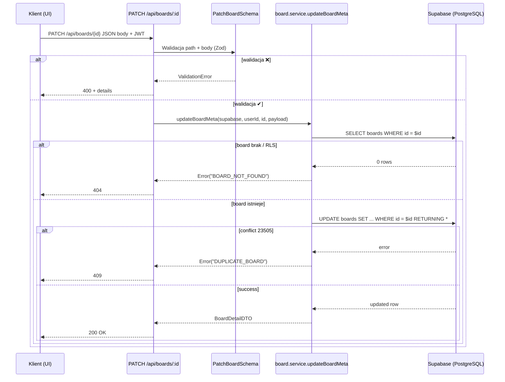

# API Endpoint Implementation Plan: PATCH /api/boards/:id

## 1. Przegląd punktu końcowego
Celem punktu końcowego jest umożliwienie właścicielowi tablicy częściowej aktualizacji metadanych tablicy (tytuł, widoczność publiczna, archiwizacja, tagi). Endpoint nie zmienia kart ani poziomów — dotyczy wyłącznie pól tabeli `boards`.

* **URL**: `/api/boards/:id`
* **Metoda**: `PATCH`
* **Uprawnienia**: Autentykowany użytkownik będący właścicielem tablicy
* **Prerender**: `export const prerender = false` (endpoint serwerowy)

---

## 2. Szczegóły żądania
### 2.1 Parametry
| Źródło | Nazwa | Typ | Wymagany | Opis |
|--------|-------|-----|----------|------|
| Path   | `id`  | `uuid` | ✔ | Id tablicy zgodny z `boards.id` |

### 2.2 Body (JSON)
Używa modelu `PatchBoardCmd` (z `src/types.ts`) z ograniczeniem do pól:
```ts
{
  title?: string;        // 1–255 znaków
  isPublic?: boolean;
  archived?: boolean;    // pozwala oznaczyć tablicę jako zarchiwizowaną
  tags?: string[];       // ≤ 10 tagów, każdy ≤ 20 znaków
}
```
*Wymagane*: co najmniej jedno pole.

---

## 3. Wykorzystywane typy
* **PatchBoardCmd** – model komend (już istnieje)
* **BoardDetailDTO** – zwracany po aktualizacji
* **Strict<T>** helper, `SortDirection` (pośrednio z types.ts)

Nowe/aktualizowane typy:
* **PatchBoardSchema** (Zod) – walidacja ciała żądania
* **BoardIdParamSchema** – już istnieje

---

## 4. Szczegóły odpowiedzi
| Kod | Body | Warunek |
|-----|------|---------|
| **200 OK** | `BoardDetailDTO` | Aktualizacja zakończona powodzeniem |
| **400 Bad Request** | `{ error, details? }` | Błąd walidacji lub archiwizowanie już zarchiwizowanej tablicy |
| **401 Unauthorized** | `{ error }` | Brak JWT lub nie jesteś właścicielem |
| **404 Not Found** | `{ error }` | Tablica nie istnieje lub brak dostępu |
| **409 Conflict** | `{ error }` | Duplikat tytułu (UNIQUE na (owner_id, title, level)) |
| **500 Internal Server Error** | `{ error }` | Inne błędy serwera |

---

## 5. Przepływ danych

---

## 6. Względy bezpieczeństwa
1. **Autoryzacja**: middleware JWT w `src/middleware/index.ts` ustawia `locals.user` i `locals.supabase` z tokenem użytkownika → RLS wymusza, aby tylko właściciel mógł `UPDATE`.
2. **Walidacja danych**: Zod + guard clauses (wcześnie odrzucamy nieprawidłowe dane).
3. **Ochrona przed masową aktualizacją**: Schema wyraźnie zawęża pola; ignoruje nieznane właściwości (`StripUnknown`).
4. **SQL Injection**: Kwerendy Supabase są parametryzowane.
5. **Duplikaty**: Obsługa błędu `23505 UNIQUE` ➜ 409 Conflict.

---

## 7. Obsługa błędów
| Kod | Mapa `getErrorMapping` | Uwagi |
|-----|------------------------|-------|
| 400 | `VALIDATION_FAILED`, `BOARD_ARCHIVED` | Walidacja lub próba zmian na archiwum |
| 401 | `NOT_OWNER`, `UNAUTHORIZED` |
| 404 | `BOARD_NOT_FOUND` |
| 409 | `DUPLICATE_BOARD` |
| 500 | `SERVER_ERROR` | fallback

---

## 8. Rozważania dotyczące wydajności
* Operacja dotyczy jednego wiersza – koszt znikomy.
* Użycie `select().single()` po `update()` zwraca zaktualizowany rekord w jednym round-trippie.
* Indeksy: `PK boards(id)` zapewnia O(1) lookup.

---

## 9. Etapy wdrożenia
1. **Validation**
   * Stwórz `PatchBoardSchema` w `src/lib/validation/boards.ts` (reuse części wspólne z `CreateBoardSchema`).
2. **Service layer**
   * Dodaj funkcję `updateBoardMeta` w `src/lib/services/board.service.ts`:
     * Parametry `(supabase, userId, boardId, payload: PatchBoardCmd)`
     * Sprawdza istnienie, właściciela, status `archived` (chyba że payload.archived === false).
     * Wykonuje `update` z `returning`.
3. **Error mapping**
   * Upewnij się, że `DUPLICATE_BOARD` i `BOARD_ARCHIVED` już istnieją w `getErrorMapping`. Jeśli nie, dodać.
4. **Route handler**
   * W `src/pages/api/boards/[id].ts` dodaj `export const PATCH`:
     1. Validate `params` (`BoardIdParamSchema`) i `request.json()` (`PatchBoardSchema`).
     2. Call `updateBoardMeta`.
     3. Zwróć `createSuccessResponse` z danymi.
     4. Obsłuż błędy analogicznie jak w GET.
5. **Docs & Changelog**
   * Aktualizuj README i OpenAPI/Redoc.
